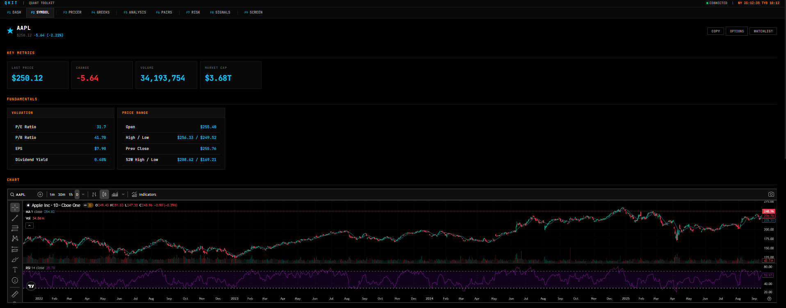

# qkit

Pure Python quantitative finance toolkit. numpy + scipy only.



## Models

| Category | Implemented |
|----------|-------------|
| **Pricing** | Black-Scholes-Merton (analytical + vectorised), Heston SV (characteristic function, Carr-Madan FFT, Gil-Pelaez quadrature), Monte Carlo (GBM, Heston full-truncation, Andersen QE, Sobol QMC), COS method (Fang-Oosterlee), Asian & Barrier with Broadie-Glasserman correction |
| **Volatility** | GARCH(1,1) / GJR-GARCH / EGARCH, SVI & SSVI calibration (Gatheral butterfly-arbitrage-free), IV surface construction |
| **Signals** | Variance Risk Premium, Pairs trading (Engle-Granger, Johansen, Kalman filter), HMM regime detection (2-state), FFT power spectrum & wavelet decomposition |
| **Portfolio** | Delta/gamma hedging, VaR & CVaR (parametric, historical, Monte Carlo, Cornish-Fisher) |
| **Backtest** | Walk-forward engine with transaction costs |

## Usage

```python
from qkit.pricing.bsm import BSM

m = BSM(S=100, K=100, T=30/365, r=0.05, sigma=0.2)
m.call_price()    # 2.5132
m.call_greeks()   # Greeks(delta=+0.546027, gamma=+0.055919, ...)
```

```python
from qkit.pricing.heston import call_price_fft

call_price_fft(S0=100, K=100, r=0.05, tau=0.5,
               V0=0.04, kappa=2.0, theta=0.04, xi=0.3, rho=-0.7)
```

```python
from qkit.pricing.monte_carlo import cos_price

cos_price(S0=100, K=100, r=0.05, sigma=0.2, tau=0.5)  # BSM match to 0.000%
```

## CLI

```
$ qkit
qkit - quantitative finance toolkit

commands:
  market     Market overview (price, fundamentals, -v for full)
  demo       BSM pricing demo
  greeks     Greeks table for spot range
  chain      Fetch option chain
  report     Generate report -> out/reports/
  serve      Start web dashboard
  regime     HMM regime detection
  svi        Calibrate SVI to IV smile
  jobs       Daily data batch jobs
```

```bash
qkit market AAPL -v           # full analysis
qkit demo --spot 150 --strike 155 --days 45
qkit regime SPY --period 5y
qkit serve                    # dashboard on localhost:5000
```

## Web Dashboard

Terminal-style dark UI. All charts interactive (Plotly).

```bash
qkit serve
# http://localhost:5000
```

## Install

```bash
git clone https://github.com/rxxuzi/qkit.git
cd qkit
pip install -e .
```

Python 3.10+

## Architecture

```
qkit/
  pricing/      BSM, IV solvers, Heston (CF + FFT + calibration),
                Monte Carlo (GBM, Heston, QE, Sobol, COS), Greeks
  volatility/   GARCH / GJR / EGARCH, SVI / SSVI
  portfolio/    Position/Portfolio, hedging, VaR/CVaR
  signals/      VRP, pairs (EG + Johansen + Kalman), HMM, spectral
  backtest/     Walk-forward engine
  data/         DataProvider interface, moomoo/yfinance, SQLite store
  web/          Flask dashboard + REST API (/api/v1/)
  pipeline/     Plotly chart generation
  reports/      HTML/Markdown report generation
```

## License

MIT
